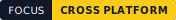
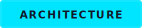
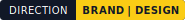

<!--
  Mr-Prince404 · GitHub Profile
  Palette:
  Cyan    #00E5FF
  Yellow  #FACC15
  Blue    #2563EB
  Fuchsia #D946EF
  Red     #E11D48
  Dark    #0D1117
-->

<div align="center">


<picture>
  <source
    media="(prefers-color-scheme: dark)"
    srcset="https://readme-typing-svg.demolab.com?font=JetBrains+Mono&weight=650&size=21&duration=2800&pause=1100&color=00E5FF&center=true&vCenter=true&repeat=true&width=920&height=58&lines=Coding+ideas%2C+bringing+dreams+to+life+%F0%9F%92%BB%E2%9C%A8;Developer+in+progress+%7C+Cool+head%2C+burning+heart+%E2%9D%A4%EF%B8%8F%E2%80%8D%F0%9F%94%A5"
  />
  <source
    media="(prefers-color-scheme: light)"
    srcset="https://readme-typing-svg.demolab.com?font=JetBrains+Mono&weight=650&size=21&duration=2800&pause=1100&color=2563EB&center=true&vCenter=true&repeat=true&width=920&height=58&lines=Coding+ideas%2C+bringing+dreams+to+life+%F0%9F%92%BB%E2%9C%A8;Developer+in+progress+%7C+Cool+head%2C+burning+heart+%E2%9D%A4%EF%B8%8F%E2%80%8D%F0%9F%94%A5"
  />
  
</picture>

<p>
  I design and build reliable software across desktop, mobile and the web,<br/>
  with a strong focus on architecture, performance and thoughtful user experiences.
</p>

<p>
  <a href="https://arthurmora-dev.vercel.app">
    
  </a>
  <a href="https://github.com/Mr-Prince404/SugoiYomi-Releases">
    
  </a>
  <a href="mailto:amh.developer.contact@gmail.com">
    
  </a>
</p>

</div>

---

## `> whoami`

<div align="center">

<picture>
  <source
    media="(prefers-color-scheme: dark)"
    srcset="https://readme-typing-svg.demolab.com?font=JetBrains+Mono&weight=700&size=18&duration=1500&pause=650&color=00E5FF&center=true&vCenter=true&repeat=true&width=920&height=45&lines=%24+initializing+developer+profile...;%24+identity+verified%3A+Arturo+Mora;%24+loading+projects%3A+4+active+products;%24+mission+ready%3A+build+software+people+can+trust"
  />
  <source
    media="(prefers-color-scheme: light)"
    srcset="https://readme-typing-svg.demolab.com?font=JetBrains+Mono&weight=700&size=18&duration=1500&pause=650&color=2563EB&center=true&vCenter=true&repeat=true&width=920&height=45&lines=%24+initializing+developer+profile...;%24+identity+verified%3A+Arturo+Mora;%24+loading+projects%3A+4+active+products;%24+mission+ready%3A+build+software+people+can+trust"
  />
  
</picture>

<br/>




</div>

<br/>

```ts
const Arturo = {
  identity: {
    name: "Arturo Mora",
    alias: "Mr-Prince404",
    location: "Mexico",
    website: "arthurmora-dev.vercel.app",
  },

  roles: [
    "Software Engineer",
    "Full-Stack Developer",
    "Product Builder",
  ],

  currentlyBuilding: {
    SugoiYomi: {
      type: "Cross-platform manga reader",
      platforms: ["Windows", "Android", "iOS"],
      status: "Active development",
    },

    SugoiYomiMobile: {
      type: "Native-feeling mobile experience",
      platforms: ["Android", "iOS"],
      status: "Foundation in progress",
    },

    OfficeExpress: {
      type: "Business operations platform",
      platforms: ["Web", "Android"],
      status: "Production",
    },

    MundoAjolote: {
      type: "Creative digital project",
      status: "In development",
    },
  },

  engineeringFocus: [
    "software architecture",
    "performance",
    "security by design",
    "native systems",
    "cross-platform development",
    "polished user experiences",
  ],

  currentMission:
    "Turn ambitious ideas into reliable products people can trust",
} as const;
```

<details open>
  <summary>
    <strong>Current build queue</strong>
  </summary>

  <br/>

  | Product | Mission | State |
  |:--|:--|:--:|
  | **SugoiYomi** | Independent cross-platform manga ecosystem | `ACTIVE` |
  | **SugoiYomi Mobile** | Polished Android and iOS reading experience | `BUILDING` |
  | **OfficeExpress** | Connected business and retail operations | `PRODUCTION` |
  | **Mundo Ajolote** | Creative project with a distinctive identity | `IN DEVELOPMENT` |

</details>

<details>
  <summary>
    <strong>Developer snapshot</strong>
  </summary>

  <br/>

  - Software Engineering student and product-focused developer
  - Creator of **SugoiYomi**
  - Developer of **OfficeExpress**
  - Building products across desktop, mobile and the web
  - Exploring secure extension systems and native infrastructure

</details>

<details>
  <summary>
    <strong>What drives the work</strong>
  </summary>

  <br/>

  > I enjoy taking technically demanding ideas from architecture diagrams to dependable products that people can actually enjoy using.

  ```text
  Ambition       starts the project
  Architecture   gives it structure
  Discipline     keeps it maintainable
  Empathy        shapes the experience
  Curiosity      pushes it forward
  ```

</details>

<br/>

<div align="center">




</div>

<br/>

---

## Selected Work

<table>
<tr>
<td width="33%" valign="top">
<div align="center">
<h3>SugoiYomi</h3>
<p><strong>Cross-platform manga reading</strong></p>


<br/><br/>

</div>
<p>A polished reading platform for Windows, Android and iOS, built around speed, extensibility, security and a clean user experience.</p>
<p>Desktop and mobile clients, local and remote reading, CBZ support, downloads, history and an independent extension engine.</p>
<details>
<summary><strong>⚡ Explore capabilities</strong></summary>
<br/>
<ul>
<li>Independent extension engine</li>
<li>Local, remote and CBZ reading</li>
<li>Downloads and reading history</li>
<li>Desktop and mobile clients</li>
<li>Cross-device sync architecture</li>
</ul>
</details>
<br/>
<div align="center">


<br/><br/>
<a href="https://github.com/Mr-Prince404/SugoiYomi-Releases"></a>
</div>
</td>
<td width="33%" valign="top">
<div align="center">
<h3>OfficeExpress</h3>
<p><strong>Business operations platform</strong></p>


<br/><br/>

</div>
<p>A web and mobile system for managing customers, sales, printing workflows, authentication, notifications, cash closing and reports.</p>
<p>Designed to connect daily business operations through a practical, cloud-backed experience.</p>
<details>
<summary><strong>⚡ Explore capabilities</strong></summary>
<br/>
<ul>
<li>Customer and sales management</li>
<li>Printing workflows</li>
<li>Cash closing and daily reports</li>
<li>Authentication and notifications</li>
<li>Web dashboard and Android app</li>
</ul>
</details>
<br/>
<div align="center">


<br/><br/>

</div>
</td>
<td width="33%" valign="top">
<div align="center">
<h3>Mundo Ajolote</h3>
<p><strong>Creative digital project</strong></p>



<br/><br/>

</div>
<p>A project in development that brings together software, visual identity and a more expressive product experience.</p>
<p>Its public presentation, imagery and technical details will be added as the project continues to grow.</p>
<details>
<summary><strong>✨ Explore direction</strong></summary>
<br/>
<ul>
<li>Distinctive product identity</li>
<li>Expressive visual design</li>
<li>Playful and polished UX</li>
<li>Creative digital presence</li>
<li>Public presentation coming later</li>
</ul>
</details>
<br/>
<div align="center">


<br/><br/>

</div>
</td>
</tr>
</table>

---

## Core Stack

<div align="center">


</div>

---

## Live Engineering Metrics

<div align="center">

<picture>
  <source
    media="(prefers-color-scheme: dark)"
    srcset="https://raw.githubusercontent.com/Mr-Prince404/Mr-Prince404/main/profile/stats-dark.svg"
  />
  <source
    media="(prefers-color-scheme: light)"
    srcset="https://raw.githubusercontent.com/Mr-Prince404/Mr-Prince404/main/profile/stats-light.svg"
  />
  
</picture>

<picture>
  <source
    media="(prefers-color-scheme: dark)"
    srcset="https://raw.githubusercontent.com/Mr-Prince404/Mr-Prince404/main/profile/top-langs-dark.svg"
  />
  <source
    media="(prefers-color-scheme: light)"
    srcset="https://raw.githubusercontent.com/Mr-Prince404/Mr-Prince404/main/profile/top-langs-light.svg"
  />
  
</picture>

</div>

<br/>

<div align="center">


</div>

<br/>

<div align="center">


<br/><br/>

<sub>
  Activity includes anonymized contributions from private product repositories.
</sub>

</div>

---

## Contribution Snake

<div align="center">

<picture>
  <source
    media="(prefers-color-scheme: dark)"
    srcset="https://raw.githubusercontent.com/Mr-Prince404/Mr-Prince404/output/github-contribution-grid-snake-dark.svg"
  />
  <source
    media="(prefers-color-scheme: light)"
    srcset="https://raw.githubusercontent.com/Mr-Prince404/Mr-Prince404/output/github-contribution-grid-snake.svg"
  />
  
</picture>

</div>

---

## Engineering Principles

```text
Architecture     before accidental complexity
Performance      without sacrificing maintainability
Security         as a foundation
Accessibility    as part of the product
Design           with purpose and restraint
Products         with a clear identity
```

> Good software should not merely work. It should feel intentional, remain understandable and earn the user's trust.

---

<div align="center">

### Turning ideas into architecture, and architecture into products.

<a href="https://arthurmora-dev.vercel.app">Portfolio</a>
&nbsp;·&nbsp;
<a href="mailto:amh.developer.contact@gmail.com">Email</a>
&nbsp;·&nbsp;
<a href="https://github.com/Mr-Prince404">GitHub</a>

<br/><br/>


<br/>

<picture>
  <source
    media="(prefers-color-scheme: dark)"
    srcset="https://readme-typing-svg.demolab.com?font=JetBrains+Mono&weight=700&size=20&duration=2400&pause=1000&color=00E5FF&center=true&vCenter=true&repeat=true&width=760&height=52&lines=Thanks+for+stopping+by!+%F0%9F%92%99;See+you+in+the+next+commit.+%E2%9C%A8"
  />
  <source
    media="(prefers-color-scheme: light)"
    srcset="https://readme-typing-svg.demolab.com?font=JetBrains+Mono&weight=700&size=20&duration=2400&pause=1000&color=2563EB&center=true&vCenter=true&repeat=true&width=760&height=52&lines=Thanks+for+stopping+by!+%F0%9F%92%99;See+you+in+the+next+commit.+%E2%9C%A8"
  />
  
</picture>

<sub>
  Every visit, star and bit of support means more than you think.
</sub>

<br/><br/>

<sub>
  Built with curiosity, discipline and a suspicious amount of late-night debugging.
</sub>

</div>

